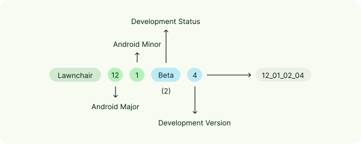

# Lawnchair Contributing Guidelines

<picture>
    <!-- Avoid image being clickable with slight workaround --->
    <source media="(prefers-color-scheme: dark)" srcset="docs/assets/lawnchair-round.webp" width="100">
    
</picture>

First and foremost, welcome to the **Lawnchair** Contributing Guidelines!

### 💫 Bug reports & feature requests

> [!TIP]
> We recommend that the Lawnchair [Nightly](https://github.com/LawnchairLauncher/lawnchair/releases/tag/nightly)
> build be used in your report as they contain the latest changes from Lawnchair.

For [bug reports](https://github.com/LawnchairLauncher/lawnchair/issues/new?assignees=&labels=bug&projects=&template=bug_report.yaml&title=%5BBUG%5D+), please describe the bug in detail to the best of your ability
with steps on how to reproduce it. If applicable, attach log files.

For [feature requests](https://github.com/LawnchairLauncher/lawnchair/issues/new?assignees=&labels=feature%2Cenhancement&projects=&template=feature_request.yaml&title=%5BFEATURE%5D+), please describe the feature you'd like to see added to Lawnchair.
If applicable, attach log files.

Please make sure to be civil during the discussion of your contribution as outlined by the [Code of Conduct](CODE_OF_CONDUCT.md).

### 🌐 Translation

For translation, visit [Lawnchair on Crowdin](https://lawnchair.crowdin.com) and follow these tips:

-   When using quotation marks, insert the symbols specific to the target language, as listed in this [this summary table](https://en.wikipedia.org/wiki/Quotation_mark#Summary_table);
-   Some English terminology may have not have commonly-used equivalents in other languages. In such cases, use short descriptive phrases—for example, the equivalent of _bottom row_ for _dock_;
-   Some languages (e.g. French) have variations of words depending on if it's masculine or feminine (gender-specific); we recommend opting for gender-neutral words instead.

### 🧑‍💻 Code

> [!NOTE]
> For Lawnchair 9 to 13, see the branches with the `9-` to `13-` prefixes respectively.

For code, it's highly recommended that you use [Android Studio](https://developer.android.com/studio),
know [Java](https://www.java.com) or preferably [Kotlin](https://kotlinlang.org/), and [Git](https://git-scm.com/).

> [!IMPORTANT]
> You can use Git to clone the repository; ensure that you include the project’s submodules using the `recursive` flag:
>
> ```
> git clone --recursive https://github.com/LawnchairLauncher/lawnchair.git
> ```

To build **Lawnchair**, select the `lawnWithQuickstepGithubDebug` build type.
Should you face errors relating to the `iconloaderlib` and `searchuilib` projects,
run `git submodule update --init --recursive`.

Here are some contribution tips to help you get started:

-   Always make sure that you're up-to-date with **Lawnchair** by setting your base branch to `14-dev`.
-   Make sure your code is logical and well-formatted. If using Kotlin, see [“Coding conventions” in the Kotlin documentation](https://kotlinlang.org/docs/coding-conventions.html);
-   [The `lawnchair` package](https://github.com/LawnchairLauncher/lawnchair/tree/14-dev/lawnchair) houses Lawnchair’s own code, whereas [the `src` package](https://github.com/LawnchairLauncher/lawnchair/tree/14-dev/src) includes a clone of the Launcher3 codebase with modifications. Generally, place new files in the former, keeping changes to the latter to a minimum.

#### Additional documentation

-   Lawnchair Visual Guidelines ([README.md](/docs/assets/README.md))
-   Lawnchair Quickstep Compat Lib ([README.md](compatLib/README.md))
-   Lawnchair Preferences Components ([README.md](lawnchair/src/app/lawnchair/ui/preferences/components/README.md))
-   SystemUI ViewCapture ([README.md](systemUIViewCapture/README.md))
-   SystemUI Common ([README.md](systemUICommon/README.md))
-   Prebuilt Library ([README.md](prebuilts/libs/README.md))

#### Versioning scheme

As of [#4361](https://github.com/LawnchairLauncher/lawnchair/pull/4361),
Lawnchair’s version code is composed of four parts, separated by underscores:

<p align="center">
    <picture>
        <source media="(prefers-color-scheme: dark)" srcset="docs/assets/version-dark.svg" width="98%">
        
        <!-- Direct the accessibility reader to read the point below --->
    </picture>
</p>

1. Android major version
2. Android minor version
3. Lawnchair development status
4. Lawnchair development version

##### Android major & minor versions

These represent the Android version in which Lawnchair is based on.
They make up the first two parts of the version code:

-   Major version: Indicates the main Android version.
-   Minor version: Reflects any point release or update within the major version.

Example: Android 11 will be `11_00_XX_XX` while Android 12.1 will be `12_01_XX_XX`.

##### Development status & version

The third and fourth parts of the version code refer to Lawnchair's development stage
and the specific version within that stage:

-   Development status: Shows the current development stage of the Lawnchair build (e.g., Alpha, Beta).
-   Development version: Specifies the incremental version within the same development stage.

The table below shows release phase used by Lawnchair:

| Status            | Stage |
| ----------------- | ----- |
| Alpha             | 01    |
| Beta              | 02    |
| Release Candidate | 03    |
| Release           | 04    |

Example: Alpha 5 will be `XX_XX_01_05` and Beta 3 will be `XX_XX_02_03`.

#### String naming

Strings `names` in `strings.xml` should follow this format:

| Type                                             | Format            | Example usage              | Actual string        | Other information                                                                                                   |
| ------------------------------------------------ | ----------------- | -------------------------- | -------------------- | ------------------------------------------------------------------------------------------------------------------- |
| Generic word                                     | $1                | `disagree_or_agree`        | Disagree or agree    | Should only be used if it doesn't fit the below categories                                                          |
| Action                                           | $1_action         | `apply_action`             | Apply                | Any generic action verb can fit here                                                                                |
| Preference or popup label<br/>Preference headers | $1_label          | `folders_label`            | Folders              |                                                                                                                     |
| Preference or popup description                  | $1_description    | `folders_description`      | Row and column count |                                                                                                                     |
| Preference choice                                | $1_choice         | `off_choice`               | Off                  |                                                                                                                     |
| Feature string                                   | (feature_name)_$1 | `colorpicker_hsb`          | HSB                  | Feature strings are strings that are confined to a specific feature. Examples include the gesture and color picker. |
| Launcher string                                  | $1_launcher       | `device_contacts_launcher` | Contacts from device | Strings that are specific to the Launcher area                                                                      |
