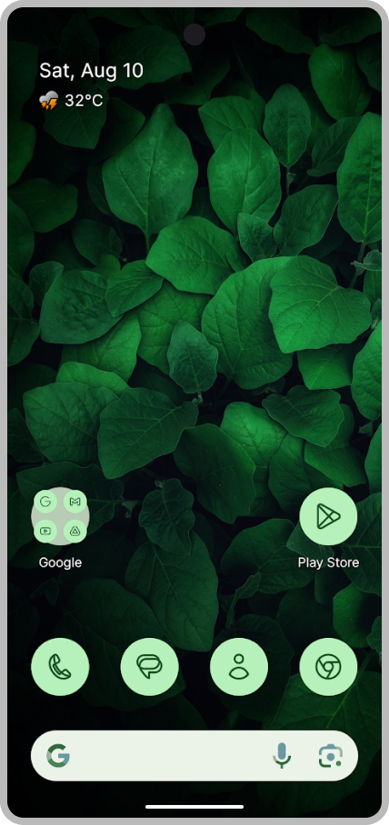

# Lawnchair 14

<picture>
    <!-- Avoid image being clickable with slight workaround -->
    <!-- ❤️ Credit to Raine for the original mockup on the Lawnchair Discord -->
    <!-- ❤️ Credit to Lawrence Kayku for the current mockup on Unsplash 
            https://unsplash.com/photos/photography-of-green-leaves-ZVKr8wADhpc 
    -->
    <source media="(prefers-color-scheme: dark)" srcset="docs/assets/device-frame.png" width="250px">
    
</picture>

Lawnchair is a free, open-source home app for Android. Taking Launcher3 — Android’s default home app — as a starting point, it ports Pixel Launcher features and introduces rich options for customization.

This branch houses the codebase of Lawnchair 14, which is currently in beta and is based on Launcher3 from Android 14. For Lawnchair 9 to 13, see the branches with the `9-` to `13-` prefixes, respectively.

## Features

-   Pixel Launcher-like UI with Material You design
-   At a Glance widget with Smartspacer support
-   QuickSwitch support
-   Global Search support
-   Icons, fonts, and colors customization
-   And more!

## Download

See the [releases](https://github.com/LawnchairLauncher/lawnchair/releases) section for the latest
beta build. For development builds with upcoming features & bug fixes, use the nightly builds.

## Contributing

Please visit the [Lawnchair Contributing Guidelines](CONTRIBUTING.md) for information and tips on contributing to Lawnchair.

## Quick links

-   [News](https://t.me/lawnchairci)
-   [Lawnchair on X (formerly Twitter)](https://x.com/lawnchairapp)
-   [Website](https://lawnchair.app)
-   [_XDA_ thread](https://forum.xda-developers.com/t/lawnchair-customizable-pixel-launcher.3627137/)

You can view all our links in the [Lawnchair Wiki](https://github.com/LawnchairLauncher/lawnchair/wiki).
