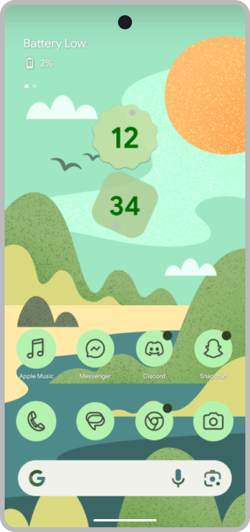

# Lawnchair
    

<picture>
    <!-- Avoid image being clickable with slight workaround --->
    <!-- ❤️ Credit to Raine on the Lawnchair Discord --->
    <source media="(prefers-color-scheme: dark)" srcset="docs/device-frame.png" width="15%">
    
</picture>

**Lawnchair** is a free, open-source home app for Android. 
Taking Launcher3 — Android’s default home app — as a starting point, 
it ports Pixel Launcher features and introduces rich options for customization.

## Features

Here are some of the features you can expect from Lawnchair
* Material You support for all Android devices;
* Fluid animation with Recent provider (root);
* At a Glance widget;
* Hide applications from your home screen;
* Google Feed integrations;
* Icon pack support and much more!

## Download

See the [Releases](https://github.com/LawnchairLauncher/lawnchair/releases) section for the latest
stable build. For development builds with new icons, use the nightly builds.

## Contributing

Please see the [Lawnchair Contributing Guidelines](CONTRIBUTING.md) as it contains everything
you'd possibly need to contribute to Lawnchair.

## Quick links

-   [News](https://t.me/lawnchairci)
-   [Lawnchair on Twitter](https://twitter.com/lawnchairapp)
-   [Website](https://lawnchair.app)
-   [_XDA_ thread](https://forum.xda-developers.com/t/lawnchair-customizable-pixel-launcher.3627137/)

You can view all our links in the [Lawnchair Wiki](https://github.com/LawnchairLauncher/lawnchair/wiki).
