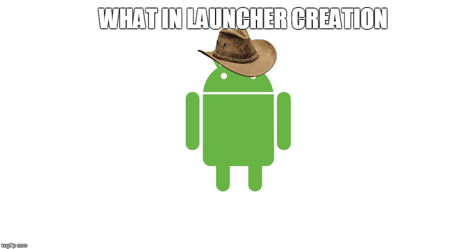

# Lawnchair - 

Yes, I know, there are already waaaay to many launchers out there.
Yes I know this won't be successful. But I am only doing this for fun (and for the pun :innocent:) anyways.
I don't even know what kind of features I want to add to this, so if you have a great idea just open an issue or submit a PR!

## How to Contribute?

Contributing to Lawnchair is pretty straight forward! Fork the project, clone your fork and start coding!

Before implementing any new big features I would be happy if you would either hit me up in an issue, or on [Telegram](https://t.me/deletescape). I probably won't reject it, but this is just to make sure that you don't invest your time for something I won't include.

Unfortunately I cannot share a decrypted version of `google-services.json`, to build without this file you will have to comment out the following lines in `build.gradle`
 * `classpath 'com.google.gms:google-services:3.1.0'` (at the beginning of the file)
 * `apply plugin: 'com.google.gms.google-services'` (at the bottom of the file)
 
> **DO NOT PUSH THIS CHANGE OR I WILL NOT ACCEPT YOUR PR UNTIL YOU CHANGE THIS!**