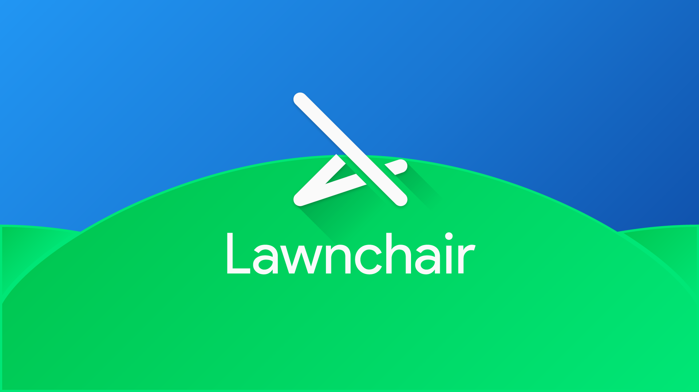

# Lawnchair -  -  -  - 

Lawnchair is a free, open source launcher aiming at bringing Pixel Launcher features to many devices. 
Download now!

## Now what does this cost?

Nothing, I am promising that Lawnchair, including all it's features, will always be free! But if you really like it, you can still buy me a beer or something via [PayPal](https://www.paypal.me/deletescape).

## How to Contribute?

Contributing to Lawnchair is pretty straightforward! Fork the project, clone your fork and start coding!

Before implementing any new big features I would be happy if you could either hit me up in via a GitHub issue, or on [Telegram](https://t.me/deletescape). I probably won't reject it, but this is just to make sure that you don't invest your time for something I won't include.

## Graphics

The official Lawnchair graphics were designed by Josh Baldassarre & Lumiq Creative. Thanks a lot to those awesome designers!
