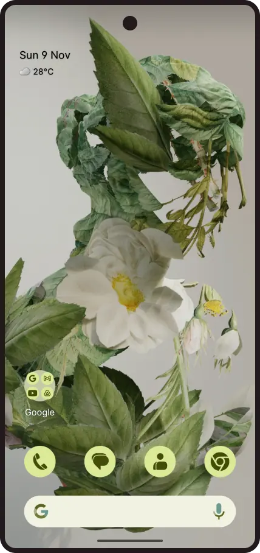

# Mica 16

> [!WARNING]
> This branch contains major changes from the rebase of Launcher3, including changes that can cause
> Mica to crash or break.
>
> For regular users, we recommend staying on *Mica 15 Beta 3*.

<picture>
    <!-- Avoid image being clickable with slight workaround -->
    <!-- ❤️ Credit to simonppt for the current mockup on Unsplash 
            https://unsplash.com/photos/a-white-flower-with-green-leaves-on-a-white-background-ojBNiaeykwc
    -->
    <source media="(prefers-color-scheme: dark)" srcset="docs/assets/device-frame.webp" width="250px">
    
</picture>

Mica is a free, open-source home app for Android. Taking Launcher3—Android’s default home app—as a starting point, it ports Pixel Launcher features and introduces rich customization options.

This branch houses the codebase of Mica 16, which is currently in development and is based on Launcher3 from Android 16. For Mica 9 to 15, see the branches with the `9-` to `15-` prefixes, respectively.

## Features

- Material 3 Expressive theming that follows your wallpaper and system colors.
- At a Glance widget support, with integration for [Smartspacer](https://github.com/KieronQuinn/Smartspacer).
- QuickSwitch support for Android Recents integration on Android 10-15 (root required).
- Global search for apps, contacts, and web results from the home screen.
- Customization options for icon packs, fonts, and color settings.

## Download

  <a href="https://play.google.com/store/apps/details?id=app.mica.play">
    <picture>
      <!-- Avoid image being clickable with slight workaround -->
      <source media="(prefers-color-scheme: dark)" srcset="docs/assets/badge-google-play.webp" height="60">
      
    </picture>
  </a>

Mica on Play Store will install as a different app compared to other sources. Features may be restricted to comply with Google Play’s publishing rules.

## Contribute

Visit the [Mica contributing guidelines](CONTRIBUTING.md) for information and tips on contributing to Mica.

## Quick links

- [GitHub](https://github.com/arcbaseproject/Mica-Launcher)
